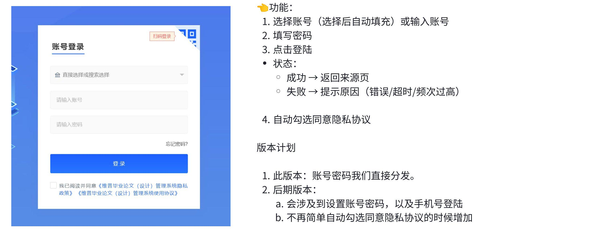
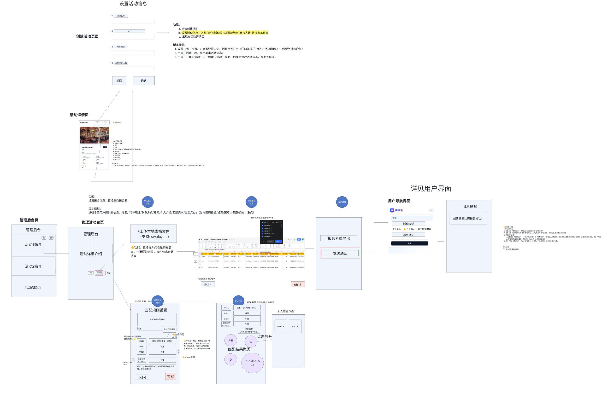
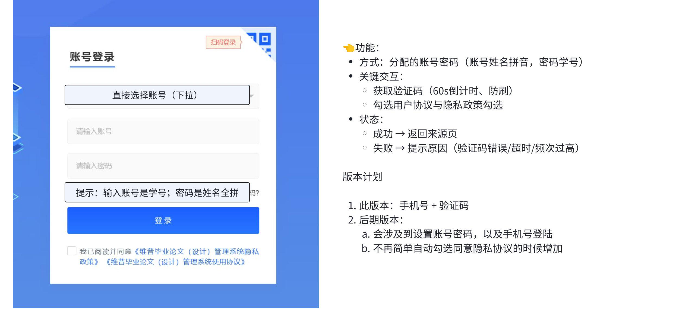
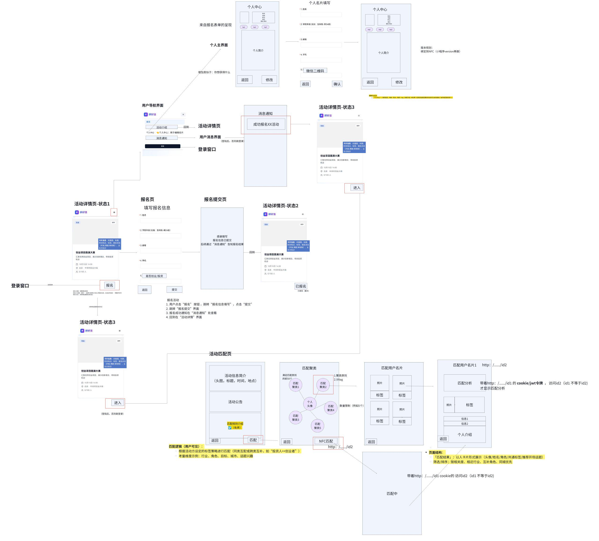

**产品文档 - 核心功能页面**

**产品需求文档**

+:-------------------+:-------------------+:-------------------------------------+
| 状态 ：√ | 文件标签： | 产品需求文档 |
| | | |
| \[√\] 草稿 | | |
| | | |
| \[\] 修改中 | | |
| | | |
| \[\] 定稿 | | |
| +--------------------+--------------------------------------+
| | 版本： | 2025(1.0) |
| +--------------------+--------------------------------------+
| | 作者： | 陆言骄 |
| +--------------------+--------------------------------------+
| | 日期： | 2025/10/20 |
| +--------------------+--------------------------------------+
| | **版本描述** | **活动信息展示、匹配、个人信息展示** |
+--------------------+--------------------+--------------------------------------+

仅为产品开发部成员阅览，请勿外传

> **1 产品功能**
>
> **1.1 产品目标**
>
> **定位**：**智能化线下活动精准参与与价值连接平台**\
> **使命**：

**连接**：聚合四类活动（学校社团/校际/社会组织/私人组局）

**沉淀**：通过活动建立真实社交关系/情感关系

**转化**：驱动教育、生活消费、创业就业场景的商业闭环

> 不仅是一个活动报名平台，更是**赋能线下活动创造深度价值的智能连接引擎**。我们致力于让每一次活动参与都精准高效，让每一次线下相遇都充满潜力，助力甲方最大化活动 ROI，构建可持续的用户关系和商业生态。
>
> **1.2 产品功能（开发）**
>
> **本网页需适配微信手机端**，将围绕以下核心功能展开：
>
> **1.2.1 商家 version（活动举办⽅）**
>
> **产品概述**
>
> 为活动主办方（商家）提供一个简洁闭环：登录 → 创建活动 → 管理报名 →
> 规则化匹配 →
> 一键通知参会者（用户侧进入其"用户导航页"查看通知与分组）。
>
> **角色**

**商家 Admin**：创建/编辑活动、配置匹配、筛选与通知。

~~**商家 Staff**：读写报名、发通知，不可删活动（非本期重点）。~~

**用户（报名者）**：在用户端接收通知、查看分组/活动详情。

~~**平台超管**：审计、风控、导出数据（非本期重点）。~~

> **核心模块**

账号登录（原型图 1）

活动详情页（原型图 2，空态 + 已创建态）

创建/编辑活动（原型图 2）

管理后台（原型图 2，活动列表、入口）

管理活动（原型图 2，报名信息流、匹配信息流、通知）

> **信息架构 & 路由**

/login 登录页（原型图 1）

/dashboard 管理后台首页（活动列表、创建入口）

/activities/create 创建活动（原型图 2）

/activities/:id 活动详情（原型图 2）

/activities/:id/manage 管理活动

overview 总览

/activities/:id/edit **创建/编辑页**

/activities/:id/enroll 报名管理（信息流 1）

/activities/:id/match 匹配配置与结果（信息流 2）

> **原型图 & 页面与交互说明**
>
> 1.1 **登陆界面**
>
> ℹ️ 功能简介：账号+密码登陆
>
> ✍️ 原型图：
>
> 
>
> **📖 页面与交互说明 ：**
>
> **表单**：账号（下拉可搜索/选择，选中后自动填充）/ 密码\
> **按钮**：登录\
> **状态与文案：**

成功：登录成功，正在加载... → 默认跳转 /dashboard

失败：提示原因

账号或密码错误

网络超时，请重试

尝试频次过高，请 X 分钟后再试

> **合规**：
>
> 灰度期可默认勾选"已阅读并同意《隐私政策/使用协议》"；**正式上线需改为默认不勾选**并必须显式同意才可登录（合规要求）。
>
> **版本规划**（来自图示）：

V1：由平台分配账号密码

后续：支持商家自设密码、手机验证码登录/重置密码

> 1.2 **活动页**
>
> ℹ️ 功能简介：活动信息展示
>
> ✍️ 原型图：
>
> 
>
> **📖 页面与交互说明 ：**
>
> 1\. **活动详情页**
>
> **空态**：当商家尚未创建活动时展示引导卡片：

标题：还没有活动

按钮：创建活动（跳转 /activities/create）

> **已创建态**（卡片信息块）：

**封面图**（必填，默认占位）

**标题**

**状态**：报名中 / 报名结束 / 活动中 / 活动结束

**活动简介**（短文案）

**报名开始时间 -- 报名结束时间**

**活动时间**（开始--结束）

**活动地点**

**人数上限（容量）**

> ~~后续扩展字段（下一版）~~\
> ~~10. **活动标签**：创业 / 娱乐 / 宠物 / 交友 / 运动 / 电竞（多选）~~

~~费用：免费 / 付费（票价、说明）~~

~~打卡口令（可选）~~

> 2\. **创建/编辑活动**
>
> **表单字段**

活动名称（必填，≤ 40 字）

简介（必填，≤ 200 字）

报名时间段（开始/结束，必填）

活动时间段（开始/结束，必填）

地点（必填，地址文本）

封面图（必填，上传）

人数上限（必填，正整数）

~~是否收费（必填：免费/付费；付费需票价）~~

~~标签（多选：创业/娱乐/宠物/交友/运动/电竞）~~

~~是否允许**打卡口令**（可选；仅展示与记录）~~

> **交互**

点击"确认"后创建活动 → 跳转活动详情页

后续在"我的活动/管理后台"可继续编辑

> 3\. **管理后台（活动列表）**

列表：封面、标题、状态、报名窗口、活动时间、容量/已报人数、最近更新时间

操作：

点击管理进入 管理活动界面

点击删除进行删除

~~支持筛选：状态、时间范围、标签~~

~~支持搜索：标题关键字~~

> 4\. **管理活动（核心，含两条信息流）**
>
> **列表字段**：封面、标题、状态、报名时间段、活动时间、容量/已报人数、最近更新、操作\
> **操作按钮（逐行）**：

**编辑** → 跳转 /activities/:id/edit

**报名管理** → 跳转 /activities/:id/enroll（导入/筛选、发通知）

**匹配** → 跳转 /activities/:id/match（规则设置/开始匹配/结果聚类）

> **空态**：无活动 → 按钮【创建活动】（到 /activities/create）
>
> **A. 创建/编辑活动页（沿用，入口调整）/activities/:id/edit**
>
> **入口**：

创建：/dashboard →【创建活动】→ /activities/create

编辑：/dashboard → 行内【编辑】→ /activities/:id/edit

> **表单字段与校验**：保持之前 V1
> 规范（标题、简介、报名/活动时间、地点、封面、容量、是否收费、标签、打卡口令等）
>
> **B. 报名管理（信息流 1）/activities/:id/enroll**
>
> **1. 导入报名信息**
>
> **功能**：从本地表格导入（**csv/xls/xlsx**）

**自动提取表头**：首行识别 → 映射到系统字段

系统字段建议：姓名、性别、年龄/年龄段、职业/行业、联系方式（手机/邮箱）、城市、个人简介、匹配需求、**自定义
tag**（如生物医药投资/投资/医疗/交友/运动等）

**字段映射 UI**：未知表头可手动绑定为"自定义字段\[n\]"

**预览与校验**：样例 20 行预览；必填缺失/手机号邮箱格式/重复记录提示

**入库**：确认后写入
Enrollment.form_data，统计成功/失败数并给出下载错误报告

> **2. 筛选报名信息**

维度：表头（例如**标签**（多选）、性别、年龄段、行业等）。需要另外标注报名时间、是否信息完整、当前状态（通过/拒绝）

筛选框： 打开筛选下拉后，顶部工具条：\
**全部 (n/l) \| 反选**

**全部**：全选/全不选（根据当前状态切换）

**反选**：把已勾选项变为未选，未选项变为已选

**列表区**：

每行有\[✓\]可以点击勾选或者把已勾选项变为未选

支持滚动加载（虚拟列表）

**底部操作区：**重置 \| **确定**

重置：清空该字段选择并恢复默认（全选）

**确定**：应用选择并刷新数据

+:-----------------------------------------------+
| 选择规则： |
| |
| **同一字段内**为 |
| **OR**（勾中的任一值匹配即可） |
| |
| **不同字段之间**为 **AND**（需同时满足） |
+------------------------------------------------+

左侧栏：

批量全选

勾选

右侧：导出 CSV/Excel

> **3. 发送通知**

入口：筛选后对所勾选的**"报名成功的用户"**→【发送通知】

状态：报名通过/报名拒绝 → 前者点击后进入活动详情页，活动信息更新到活动详情页

发送渠道：**站内通知**（用户端 /u/home 可见）

按钮【报名名单导出】导出 CSV/Excel

> **B. 匹配（信息流 2）/activities/:id/match**
>
> **1. 匹配规则设置**

---

目标：商家能**用自然语言描述**活动倾向，一键生成**结构化字段规则**，再用**滑块**细调权重与**约束**。支持保存为模板与回溯。

---

**活动匹配期望**（多行文本）

> **文本输入框**：_"描述活动匹配期望"_（多行）
>
> **提示示例**（占位灰字）：
>
> "例如：尽量跨院校、跨行业，兴趣重合优先，男女比例均衡。"
>
> **旁边按钮**：生成匹配规则
>
> **生成结果**：在下方"字段规则列表"中以条目出现（可编辑）

---

调用 NLP
服务将自然语言解析成结构化**字段规则**与**初始权重**

---

**字段规则列表**（可增删）：

规则名（一句话，如"性别男女匹配"/"同校优先结对"）

**权重滑块**（0--100%，权重总和显示与校验）

+:----------------------------------------+
| 默认三到五条，如： |
| |
| **兴趣相似**（Jaccard）--- _权重 30%_ |
| |
| **行业互补**（行业不同加分）--- _权重 |
| 20%_ |
| |
| **院校多样**（避免同校聚集）--- _权重 |
| 15%_ |
| |
| **性别均衡**（男女混合优先）--- _权重 |
| 20%_ |
| |
| **历史回避**（上次同组惩罚）--- _权重 |
| 15%_ |
+-----------------------------------------+

可添加**自定义文本规则**（存入 config.prompts）

新增规则 → 填写**一句话规则名**（会同步保存到 config.prompts）

---

Plain Text\
 注解：建议考虑两个方面，分别是**规则类型**（相似/互补/排他/强制）和字段（例如：学校/行业/城市/年龄段/标签/性别/历史），

---

**边界条件**（保择）：最小/最大组人数、性别比例、同行业最多 N
人、黑白名单

---

**权重和校验:**加起来不等于 100%
时也允许发布，需要计算一下权重，按比例归一

---

**保留上次记录**：回溯上次配置与结果

> **2. 控制台（折叠卡片）**

**运行设置快照**：展示当前权重条、约束摘要

**按钮**：

**开始匹配**：入队 → 轮询进度条（30% 预处理 / 60% 匹配 / 10% 生成说明）

完成后出现：重新匹配（保留锁定，重新计算） \| 恢复为上次结果

> **开始匹配**

执行：点击【开始匹配】→ 进入队列任务

结果：**聚类/分组可视化**（A-B、C、E+D+F...），每个组显示综合得分与理由要点

**发布结果**：固化到 MatchGroup

> **结果视图**

**总览（默认）**：**气泡聚类视图**（你的圆圈视觉保留但更信息化）

每个**组**是一个气泡：面积=人数，颜色深浅=平均分

悬浮：显示组内主要匹配理由 Top3

点击气泡 → 右侧 C 区显示"该组成员卡片"，中部切换到**组卡片视图**

**组卡片视图**：卡片内显示成员头像/名、每人 Top2 匹配标签

**未入组**：单独一列卡片

> **发布**

**发布确认弹窗**：摘要（组数、每组人数范围、未入组
N、人群分布、通知对象数）

勾选：发布后立即通知成员（站内）

成功提示：已发布至用户端，成员可在"我的活动/分组"查看

> **C. 通知中心**

**渠道（V1）**：站内通知（用户端 /u/home 展示）

**模板**：报名通过、报名拒绝、匹配结果发布、活动变更

**记录**：发送状态（排队/成功/失败）、时间、触达数量

**重发**：对失败条目可重试

> **1.2.2 用户页面功能**
>
> **用户端网页 PRD（V1）**原型流：

活动详情页 → 报名表 → 提交页 →（收到通知）→ 活动详情"进入" →
活动匹配页（聚类/名片/NFC）→ 用户名片/个人中心。

与商家端已定义的数据结构、通知与匹配结果保持一致

> **目标**：让报名者在活动前后完成资料填写、查看报名状态、进入活动匹配页找人/成组，并通过
> NFC/链接查看彼此匹配分析与破冰信息。\
> **用户**：报名者（登录后有唯一
> user_id），旁观未登录用户仅能浏览公开活动信息。
>
> **信息架构 & 路由**

/ 首页/活动列表（可选，V1 可省）

/activities/:id **活动详情页**（状态 1/2/3）

/activities/:id/enroll **报名表单页**

/activities/:id/enroll/thanks **报名提交页**

/activities/:id/match **活动匹配页**（活动信息/公告/聚类）

/cards **我的名片**（个人中心主页）

/cards/edit **名片编辑**（资料表单）

/u/notifications **消息通知**

/p/:id2 **他人名片页**（带匹配分析；需 id1 已登录且与 id2 不同）

/login 登录（未登录访问受限页时弹出/重定向）

> 1\. **登陆界面**
>
> ℹ️ 功能简介：账号+密码登陆
>
> ✍️ 原型图：
>
> 
>
> 功能和商家登录的一样，只是直接选择里面找不到，必须得输入
>
> 2\. **活动页**
>
> ℹ️ 功能简介：活动信息和匹配信息展示
>
> ✍️ 原型图：
>
> 

**3.1 活动详情页 /activities/:id**

**卡片信息**：封面、标题、时间、地点、人数、标签、主办方标识、费用。\
**状态**

**状态 1（报名前/开放报名）**：主按钮 **【报名】** → /enroll。

**状态 2（报名提交后，待审核）**：主按钮变灰
**【已提交】**，顶部露出"查看消息通知"。

**状态 3（报名通过，活动开始前/中）**：主按钮 **【进入】** →
/match（未登录则先登录）。

**3.2 报名页 /activities/:id/enroll**

**默认字段（与你原型一致，可配置）**

姓名（必填）

学院/年级（必填）

邮箱（必填）

手机（必填）

是否创业/投资（单选/多选标签）

---

额外可配：城市、行业、兴趣标签、个人简介、微信二维码（图片，V1
可选）

---

**校验**：邮箱格式、手机号段、二维码图片 ≤2MB。\
**动作**：提交 → 成功进入 **报名提交页**；失败给出逐字段错误。\
**隐私提示**：提交即同意活动隐私与使用条款（链接）。

**提交页** /enroll/thanks

"感谢填写，报名信息已提交。结果将通过【消息通知】告知。"

返回活动详情 按钮。

**3.3 活动匹配页 /activities/:id/match**

---

仅 **报名通过** 且登录用户可访问；否则提示并引导回详情/登录。

---

**结构**

**活动信息简介卡**：头图、标题、时间、地点（固定吸顶小卡）。

**活动公告**：由主办方编辑的文字（支持链接）。

**匹配规则简介（可折叠）**：展示活动采用的匹配维度说明（免费可见）。

**匹配聚类区**（核心）

展示与我（id1）**高度相关的聚类/人群**气泡卡（与你原型一致），如"投资人""创业者-硬科技""同城同校"等。

每个聚类卡显示：聚类名、与我的相关度分（或排名）、候选人数上限（如 Top
15）。

**点击聚类卡** → 进入 **匹配用户名片列表**（见下）

**NFC 匹配**（底部按钮）

点击提示：使用手机**碰一碰/扫码**现场卡片 → 打开对方名片
URL（/p/:id2），自动带上我方 Cookie/JWT 以展示**双方匹配分析**。

**匹配用户名片列表（来自某一聚类）**

卡片元素：头像、姓名/昵称、角色标签、共同标签、推荐开场话题（1
条）、同城标识。

排序切换：**匹配分** / 相似度（同类） / 互补度 / 同城优先。

筛选：同校/不同校、同城、是否投资/是否创业等。

**点击名片** → 打开 **/p/:id2**（详见 3.5）。

支持无限加载，每次 20 条。

**空态**：暂无匹配对象 → 引导去完善名片信息（按钮到 /cards/edit）。

**3.4 个人中心（我的名片） /cards & /cards/edit**

**我的名片**

展示：头像、姓名/昵称、院校/年级、行业/角色标签（可多选）、兴趣标签（最多
8）、个人简介、微信二维码（可展示/隐藏开关）。

按钮：修改（到编辑页） / 预览公开页（到 /p/:self，不展示匹配分析）

**编辑页**（表单）

字段与你在原型里的"个人名片填写"一致：姓名、学院年级、邮箱、手机、微信二维码、个人简介 +
标签（角色、兴趣）。

校验与占位文案（必填/选填）

确认 保存并回到 /cards。

**可见性设置**（V1 简化）

微信二维码：**仅在双方互换时可见**（在对方页点击"交换联系方式"后显示）

邮箱/手机：默认不在公开页展示。

**3.5 他人名片页（带匹配分析） /p/:id2**

**访问条件**

当前已登录（id1）

id1 != id2

来自同一活动的上下文（从 /match 点击或 NFC/二维码打开）

**页面块**

**上半部：他人名片信息**（头像、姓名/昵称、角色、标签、简介）

**匹配分析**（仅 id1 访问 id2 时显示）

综合匹配分 + 维度拆解条（兴趣相似、行业互补、同城等）

**推荐开场话题**（1--3 条，示例：共同兴趣、活动话题）

共同标签 / 互补标签

**动作**

打个招呼（站内小弹窗：快捷模板 + 自定义输入）

交换联系方式（双方同意后显示微信二维码 / 邮箱；对方同意前不可见）

**安全**

URL 形式 p/:slug（非纯自增 ID，防枚举）

限流：同一登录用户 1 分钟内最多打开 12 个不同名片链接

仅当携带活动上下文（Cookie/JWT）时展示匹配分析；否则仅展示对方公开名片。

**3.6 消息通知 /u/notifications**

卡片：标题、时间、来源（某活动）、状态点（未读/已读）

通知类型：报名结果（通过/候补/拒绝）、活动变更、分组/匹配结果、收到"打招呼"/交换请求

点击详情 →（若有关联活动）可跳转回活动详情或匹配页
