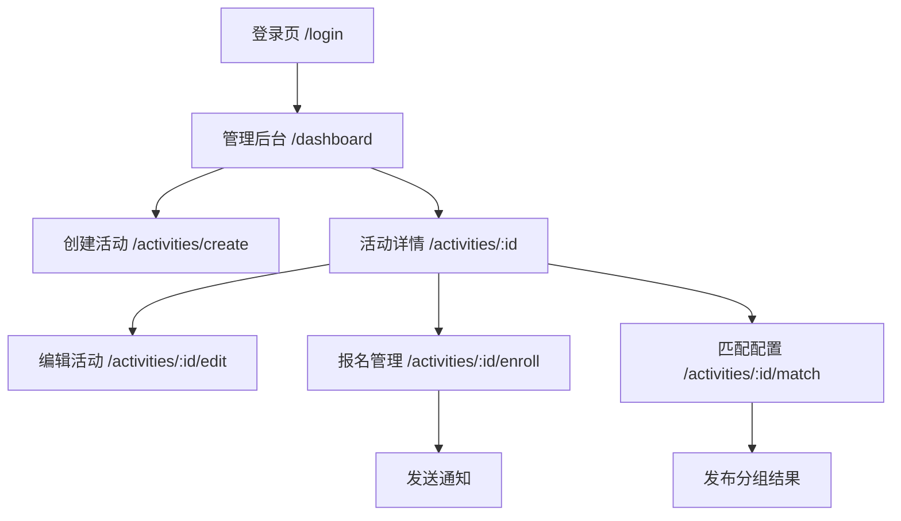

# 活动家智能连接平台 - 产品需求文档

## 1. 产品概述

**定位**：智能化线下活动精准参与与价值连接平台

**使命**：
- 连接：聚合四类活动（学校社团/校际/社会组织/私人组局）
- 沉淀：通过活动建立真实社交关系/情感关系
- 转化：驱动教育、生活消费、创业就业场景的商业闭环

不仅是一个活动报名平台，更是赋能线下活动创造深度价值的智能连接引擎。我们致力于让每一次活动参与都精准高效，让每一次线下相遇都充满潜力，助力甲方最大化活动ROI，构建可持续的用户关系和商业生态。

**适配要求**：本网页需适配微信手机端

## 2. 核心功能

### 2.1 用户角色

| 角色 | 注册方式 | 核心权限 |
|------|----------|----------|
| 商家Admin | V1：平台分配账号密码 后续版本：支持商家自设密码、手机验证码登录/重置密码 | 创建/编辑活动、管理报名、配置匹配规则、发送通知 |
| 用户（报名者） | 在用户端接收通知、查看分组/活动详情 | 查看通知与分组、进入用户导航页 |

### 2.2 核心模块

**产品概述**：为活动主办方（商家）提供一个简洁闭环：登录→创建活动→管理报名→规则化匹配→一键通知参会者（用户侧进入其"用户导航页"查看通知与分组）。

**核心模块**：
i. 账号登录（原型图1）
ii. 活动详情页（原型图2，空态+已创建态）
iii. 创建/编辑活动（原型图2）
iv. 管理后台（原型图2，活动列表、入口）
v. 管理活动（原型图2，报名信息流、匹配信息流、通知）

**信息架构&路由**：
- /login 登录页（原型图1）
- /dashboard 管理后台首页（活动列表、创建入口）
- /activities/create 创建活动（原型图2）
- /activities/:id 活动详情（原型图2）
- /activities/:id/manage 管理活动
  - overview 总览
  - /activities/:id/edit 创建/编辑页
  - /activities/:id/enroll 报名管理（信息流1）
  - /activities/:id/match 匹配配置与结果（信息流2）

### 2.3 页面详情

#### 2.3.1 登录界面 (/login)

**功能简介**：账号+密码登录

**页面与交互说明**：
- **表单**：账号（下拉可搜索/选择，选中后自动填充）/密码
- **按钮**：登录
- **状态与文案**：
  - 成功：登录成功，正在加载… →默认跳转 /dashboard
  - 失败：提示原因
    - 账号或密码错误
    - 网络超时，请重试
    - 尝试频次过高，请X分钟后再试
- **合规**：
  - 灰度期可默认勾选"已阅读并同意《隐私政策/使用协议》"
  - 正式上线需改为默认不勾选并必须显式同意才可登录（合规要求）
- **版本规划**：
  - V1：由平台分配账号密码
  - 后续：支持商家自设密码、手机验证码登录/重置密码

#### 2.3.2 活动页 (/activities/:id)

**功能简介**：活动信息展示

**1. 活动详情页**
- **空态**：当商家尚未创建活动时展示引导卡片：
  - 标题：还没有活动
  - 按钮：创建活动（跳转/activities/create）
- **已创建态**（卡片信息块）：
  1. 封面图（必填，默认占位）
  2. 标题
  3. 状态：报名中/报名结束/活动中/活动结束
  4. 活动简介（短文案）
  5. 报名开始时间–报名结束时间
  6. 活动时间（开始–结束）
  7. 活动地点
  8. 人数上限（容量）

**2. 创建/编辑活动**
- **表单字段**：
  - 活动名称（必填，≤ 40字）
  - 简介（必填，≤ 200字）
  - 报名时间段（开始/结束，必填）
  - 活动时间段（开始/结束，必填）
  - 地点（必填，地址文本）
  - 封面图（必填，上传）
  - 人数上限（必填，正整数）
- **交互**：
  - 点击"确认"后创建活动→跳转活动详情页
  - 后续在"我的活动/管理后台"可继续编辑

**3. 管理后台（活动列表）**
- **列表**：封面、标题、状态、报名窗口、活动时间、容量/已报人数、最近更新时间
- **操作**：
  - 点击管理进入管理活动界面
  - 点击删除进行删除

**4. 管理活动（核心，含两条信息流）**
- **列表字段**：封面、标题、状态、报名时间段、活动时间、容量/已报人数、最近更新、操作
- **操作按钮（逐行）**：
  - 编辑 →跳转 /activities/:id/edit
  - 报名管理 →跳转 /activities/:id/enroll（导入/筛选、发通知）
  - 匹配 →跳转 /activities/:id/match（规则设置/开始匹配/结果聚类）
- **空态**：无活动→按钮【创建活动】（到 /activities/create）

#### 2.3.3 报名管理 (/activities/:id/enroll)

**A. 创建/编辑活动页（沿用，入口调整）/activities/:id/edit**
- **入口**：
  - 创建：/dashboard →【创建活动】→ /activities/create
  - 编辑：/dashboard →行内【编辑】→ /activities/:id/edit
- **表单字段与校验**：保持之前V1规范（标题、简介、报名/活动时间、地点、封面、容量、是否收费、标签、打卡口令等）

**B. 报名管理（信息流1）/activities/:id/enroll**

**1. 导入报名信息**
- **功能**：从本地表格导入（csv/xls/xlsx）
- **自动提取表头**：首行识别→映射到系统字段
  - 系统字段建议：姓名、性别、年龄/年龄段、职业/行业、联系方式（手机/邮箱）、城市、个人简介、匹配需求、自定义tag（如生物医药投资/投资/医疗/交友/运动等）
- **字段映射UI**：未知表头可手动绑定为"自定义字段[n]"
- **预览与校验**：样例20行预览；必填缺失/手机号邮箱格式/重复记录提示
- **入库**：确认后写入Enrollment.form_data，统计成功/失败数并给出下载错误报告

**2. 筛选报名信息**
- **维度**：表头（例如标签（多选）、性别、年龄段、行业等）。需要另外标注报名时间、是否信息完整、当前状态（通过/拒绝）
- **筛选框**：打开筛选下拉后，顶部工具条：
  - 全部(n/l) | 反选
  - 全部：全选/全不选（根据当前状态切换）
  - 反选：把已勾选项变为未选，未选项变为已选
  - 列表区：
    - 每行有[✓]可以点击勾选或者把已勾选项变为未选
    - 支持滚动加载（虚拟列表）
  - 底部操作区：重置 | 确定
    - 重置：清空该字段选择并恢复默认（全选）
    - 确定：应用选择并刷新数据
- **选择规则**：
  - 同一字段内为OR（勾中的任一值匹配即可）
  - 不同字段之间为AND（需同时满足）
- **左侧栏**：
  - 批量全选
  - 勾选
- **右侧**：导出CSV/Excel

**3. 发送通知**
- **入口**：筛选后对所勾选的"报名成功的用户"→【发送通知】
- **状态**：报名通过/报名拒绝→前者点击后进入活动详情页，活动信息更新到活动详情页
- **发送渠道**：站内通知（用户端/u/home 可见）
- **按钮【报名名单导出】**导出CSV/Excel

#### 2.3.4 匹配配置 (/activities/:id/match)

**B. 匹配（信息流2）/activities/:id/match**

**1. 匹配规则设置**
- **目标**：商家能用自然语言描述活动倾向，一键生成结构化字段规则，再用滑块细调权重与约束。支持保存为模板与回溯。
- **活动匹配期望**（多行文本）
  - 文本输入框："描述活动匹配期望"（多行）
  - 提示示例（占位灰字）："例如：尽量跨院校、跨行业，兴趣重合优先，男女比例均衡。"
  - 旁边按钮：生成匹配规则
  - 生成结果：在下方"字段规则列表"中以条目出现（可编辑）
  - 调用NLP服务将自然语言解析成结构化字段规则与初始权重
- **字段规则列表**（可增删）：
  - 规则名（一句话，如"性别男女匹配"/"同校优先结对"）
  - 权重滑块（0–100%，权重总和显示与校验）
  - 默认三到五条，如：
    - 兴趣相似（Jaccard）— 权重30%
    - 行业互补（行业不同加分）— 权重20%
    - 院校多样（避免同校聚集）— 权重15%
    - 性别均衡（男女混合优先）— 权重20%
    - 历史回避（上次同组惩罚）— 权重15%
  - 可添加自定义文本规则（存入config.prompts）
  - 新增规则→填写一句话规则名（会同步保存到config.prompts）
- **边界条件**（保择）：最小/最大组人数、性别比例、同行业最多N人、黑白名单
- **权重和校验**：加起来不等于100%时也允许发布，需要计算一下权重，按比例归一
- **保留上次记录**：回溯上次配置与结果

**2. 控制台（折叠卡片）**
- **运行设置快照**：展示当前权重条、约束摘要
- **按钮**：
  - 开始匹配：入队→轮询进度条（30%预处理/ 60%匹配/ 10%生成说明）
  - 完成后出现：重新匹配（保留锁定，重新计算）| 恢复为上次结果
- **开始匹配**
  - 执行：点击【开始匹配】→进入队列任务
  - 结果：聚类/分组可视化（A-B、C、E+D+F…），每个组显示综合得分与理由要点
  - 发布结果：固化到MatchGroup；可选立即通知组内成员（站内）

**3. 结果视图**
- **总览（默认）**：气泡聚类视图（你的圆圈视觉保留但更信息化）
  - 每个组是一个气泡：面积=人数，颜色深浅=平均分，角标=锁定🔒/异常⚠️
  - 悬浮：显示组内成员头像/名、平均分、最低分、主要匹配理由Top3
  - 点击气泡→右侧C区显示"该组成员卡片"，中部切换到组卡片视图
- **组卡片视图**：卡片内显示成员头像/名、每人Top2理由标签；支持拖拽交换成员，卡片右上角🔒锁组
- **未入组**：单独一列卡片，给出系统建议去向（Top3组+增益分）

**4. 发布**
- **发布确认弹窗**：摘要（组数、每组人数范围、未入组N、人群分布、通知对象数）
- 勾选：发布后立即通知成员（站内）
- 成功提示：已发布至用户端，成员可在"我的活动/分组"查看

#### 2.3.5 通知中心

- **渠道（V1）**：站内通知（用户端/u/home 展示）
- **模板**：报名通过、报名拒绝、进入候补、匹配结果发布、活动变更
- **记录**：发送状态（排队/成功/失败）、时间、触达数量
- **重发**：对失败条目可重试

## 3. 核心流程

### 3.1 商家操作流程

商家登录后，首先进入管理后台查看活动列表。如果没有活动，可以点击创建活动按钮进入活动创建页面，填写活动基本信息后保存。活动创建完成后，可以进入报名管理页面导入参与者信息，通过筛选功能选择合适的参与者并发送通知。最后在匹配配置页面设置匹配规则，执行智能匹配算法生成分组结果并发布给参与者。

### 3.2 页面导航流程图

## 4. 用户界面设计

### 4.1 设计风格

- **主色调**：蓝色系（#1890FF）作为主色，灰色系（#F5F5F5）作为背景色
- **按钮样式**：圆角按钮，主要按钮使用渐变效果
- **字体**：系统默认字体，标题16px，正文14px，辅助文字12px
- **布局风格**：卡片式布局，顶部导航栏，适配移动端触摸操作
- **图标风格**：线性图标，简洁现代

### 4.2 页面设计概览

| 页面名称 | 模块名称 | UI元素 |
|----------|----------|--------|
| 登录页面 | 登录表单 | 居中卡片布局，蓝色主按钮，下拉选择框，密码输入框 |
| 管理后台首页 | 活动列表 | 卡片列表布局，每个卡片包含封面图、标题、状态标签、操作按钮 |
| 创建活动页 | 表单区域 | 垂直表单布局，图片上传区域，时间选择器，文本输入框 |
| 报名管理页 | 数据表格 | 表格布局，筛选器面板，批量操作工具栏 |
| 匹配配置页 | 规则设置 | 权重滑块，规则卡片，折叠面板 |
| 匹配配置页 | 结果展示 | 气泡图可视化，拖拽交互，悬浮提示 |

### 4.3 响应式设计

本产品专为微信手机端设计，采用移动优先的响应式布局。界面元素针对触摸操作进行优化，按钮尺寸不小于44px，支持手势操作如拖拽、滑动等。