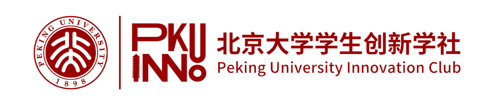

需要学社提供：

0、logo

{width="6.5in" height="1.476388888888889in"}

1、活动图片

（雨欣制作中，10.30早上给）

2、标题

北京大学学生创新学社秋季骨干迎新会

3、活动时间

2025 年 10 月 31日（周五晚）18：00-23：00

4、活动地点

海淀区青龙桥街道二河开21号艺术区wespace 轰趴营地

5、主办方

北京大学学生创新学社

6、活动费用

免费

7、报名人数

220人

8、活动时长

5小时

9、活动详情

青春逢创新,骨干聚初心。北京大学学生创新学社2025年秋季骨干迎新会以"创新"为纽带，连接新老骨干，打造"有温度、有活力、有资源"的社群生态。

活动流程：

1.  17:30-18:00**「暖场签到」** 签到时可领取定制伴手礼哟

2.  18:00-18:10**「开场仪式」**

3.  18:10-18:30**「会长致辞 ，部长团介绍」**

4.  18:30-19:40**「节目与互动，游戏与抽奖」**

5.  19:40-22:40**「自由交流，匹配与链接」**

> 小贴士：
>
> **NFC互动匹配**：现场设置"匹配互动环节"。我们根据每位骨干的学院、部门、年级、兴趣、创投资源等信息为你匹配了契合的伙伴。

1.  可通过**现场二维码查询**，快速锁定"志同道合"的伙伴；

2.  参与者可**通过手机贴近对方的NFC手环**，实时查看**两人匹配度**（如"兴趣契合度"，"资源互补度"，"都对'人工智能'感兴趣"）。

> 期待你在现场找到志同道合的"创新搭子"，开启属于你的骨干之旅！
>
> **茶歇区**：提供餐食和饮品，大家可自由交流，或约匹配骨干一起探讨未来想做的活动项目、资源对接或其他需求（如"想找技术合伙人"）。

10、活动标签

#骨干迎新 #创新创业 #互动匹配 #NFC联动 #创意交流 #资源对接

11、活动公告

**亲爱的骨干伙伴们：**

为确保活动顺利开展，请留意以下事项：

1.  请主持人、节目组和工作组提前至少15分钟到达现场；

2.  **互动提示**：现场设置"骨干匹配环节"，如有疑问可咨询外联部陆言骄部长；NFC手环为学社给大家定制的个人专属周边，请勿遗失，后续学社活动可继续使用。

3.  **注意事项**：请保管好个人物品，遵守现场秩序；活动提供茶歇，请适量取用，保持现场整洁。

4.  **联系方式**：如有紧急情况，请联系活动负责人：杨蕴涵部长（19950747357）。
